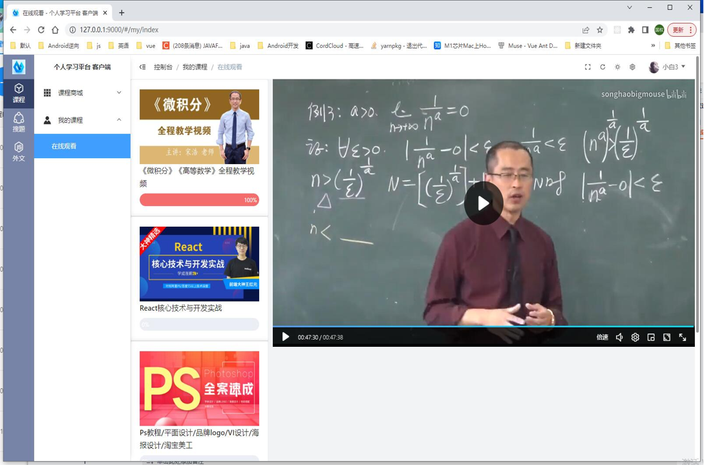
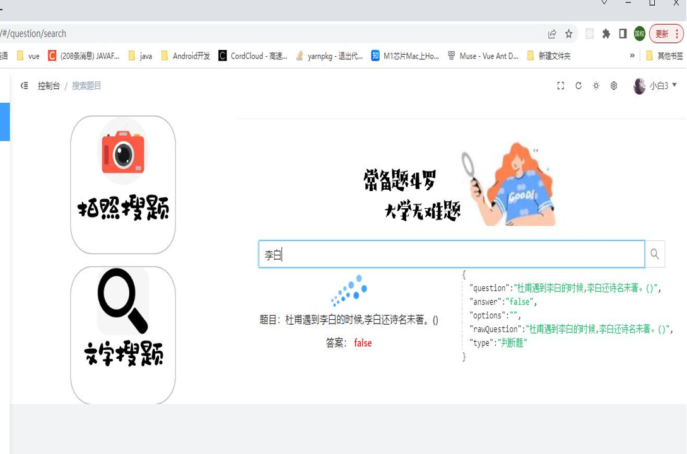

<h1 style='text-align:center'>基于SpringBoot的在线学习系统</h1>

项目基于SpringBoot+Vue3+Electron+ElasticSearch+Mysql+ElementPlus编写实现。

Nodejs实现的课程后台管理器：

选购课程：

在线观看课程：

在线搜题功能：（因本人所收录的百万级题库具有商用价值，该板块数据库暂不开源）

